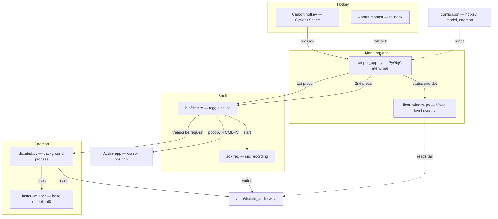
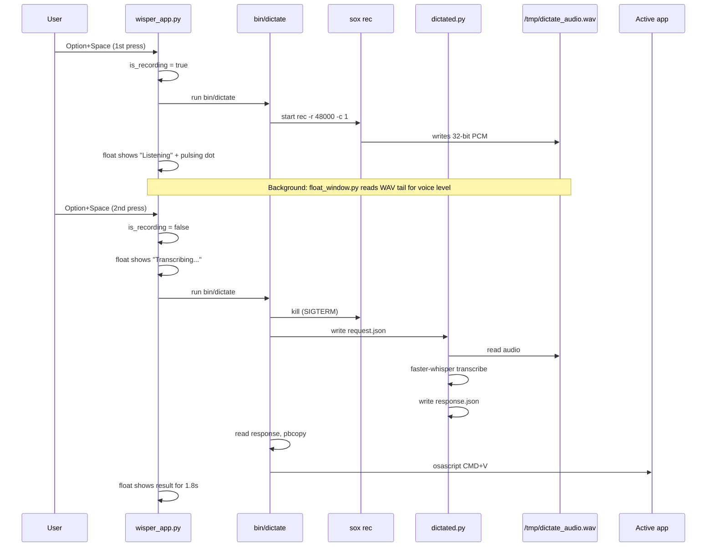
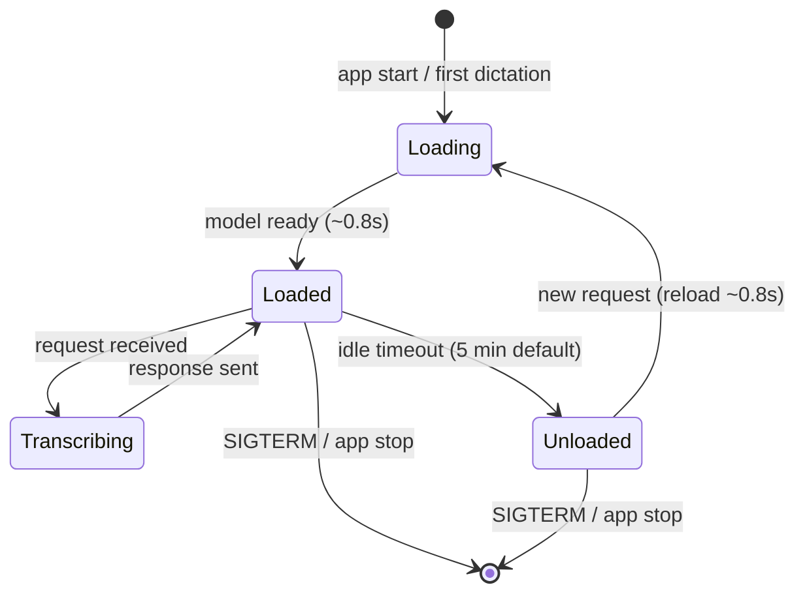
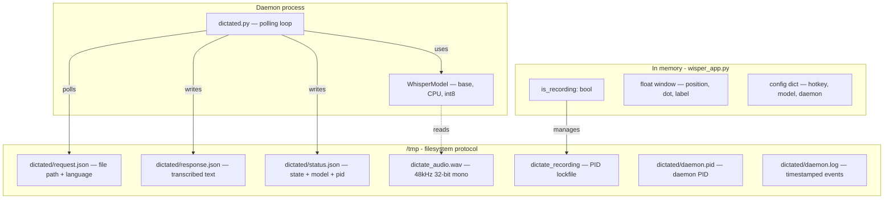
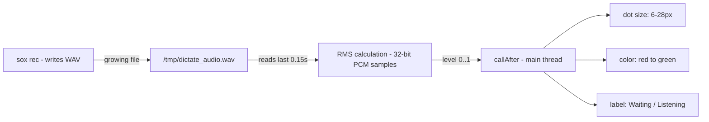
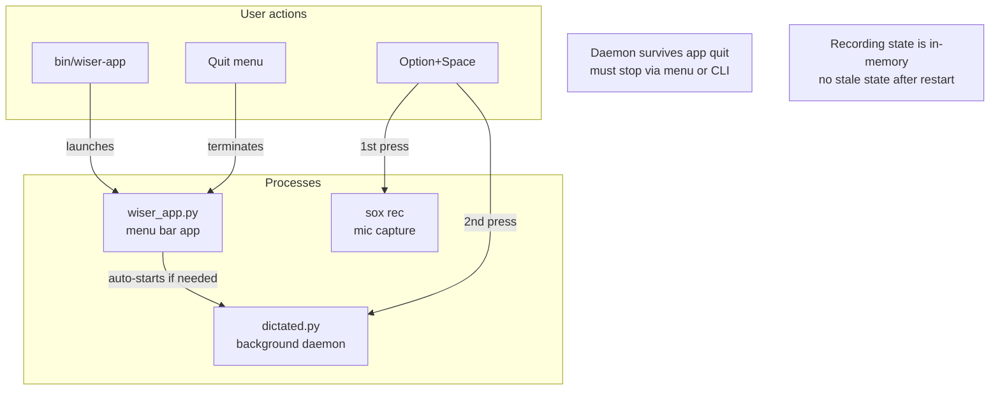

# Wisper Architecture

## System overview



## Dictation flow (step by step)



## Daemon lifecycle (model loading)



### Auto-unload rules

| Model | `keep_loaded_models` | Behavior |
|---|---|---|
| `tiny` | ✅ yes | Always in RAM, never unloads |
| `base` | ✅ yes | Always in RAM, never unloads |
| `small` | ❌ no | Unloads after 5min idle, reloads on demand |
| `medium` | ❌ no | Unloads after 5min idle, reloads on demand |
| `large-v3-turbo` | ❌ no | Unloads after 5min idle, reloads on demand |

Configured in `config.json`:
```json
{
  "daemon": {
    "unload_timeout_minutes": 5,
    "keep_loaded_models": ["tiny", "base"]
  }
}
```

## State management (what lives where)



### Communication protocol

The app and daemon communicate via files in `/tmp/dictated/`:

```
bin/dictate                           dictated.py
    │                                     │
    │  write /tmp/dictated/request.json   │
    │ ──────────────────────────────────> │
    │  {"file": "/tmp/dictate_audio.wav"} │
    │                                     │ load model if unloaded
    │                                     │ transcribe audio
    │  read /tmp/dictated/response.json   │
    │ <────────────────────────────────── │
    │  {"text": "Hello world"}            │
    │                                     │
    │  pbcopy + CMD+V into active app     │
```

## Voice level visualization



Key detail: reads **raw bytes** from file tail (skipping 44-byte WAV header), not via `wave.open()`. Sox writes a placeholder header with ~2GB frame count that breaks `wave`.

## Process lifecycle



## Memory usage

| Component | RAM | When |
|---|---|---|
| `wiser_app.py` | ~30 MB | While app is running |
| `dictated.py` (daemon) | ~20 MB | Always (survives app quit) |
| Whisper `base` model | ~145 MB | While loaded (pinned) |
| Whisper `small` model | ~488 MB | While loaded (auto-unloads) |
| `sox rec` | ~5 MB | During recording only |
| `/tmp/dictate_audio.wav` | disk only | During recording |
