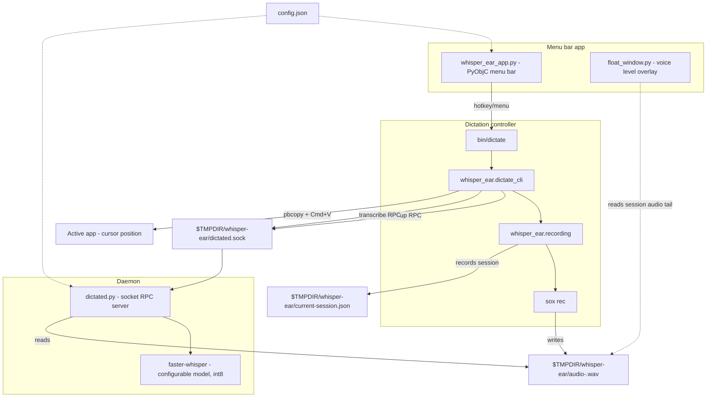
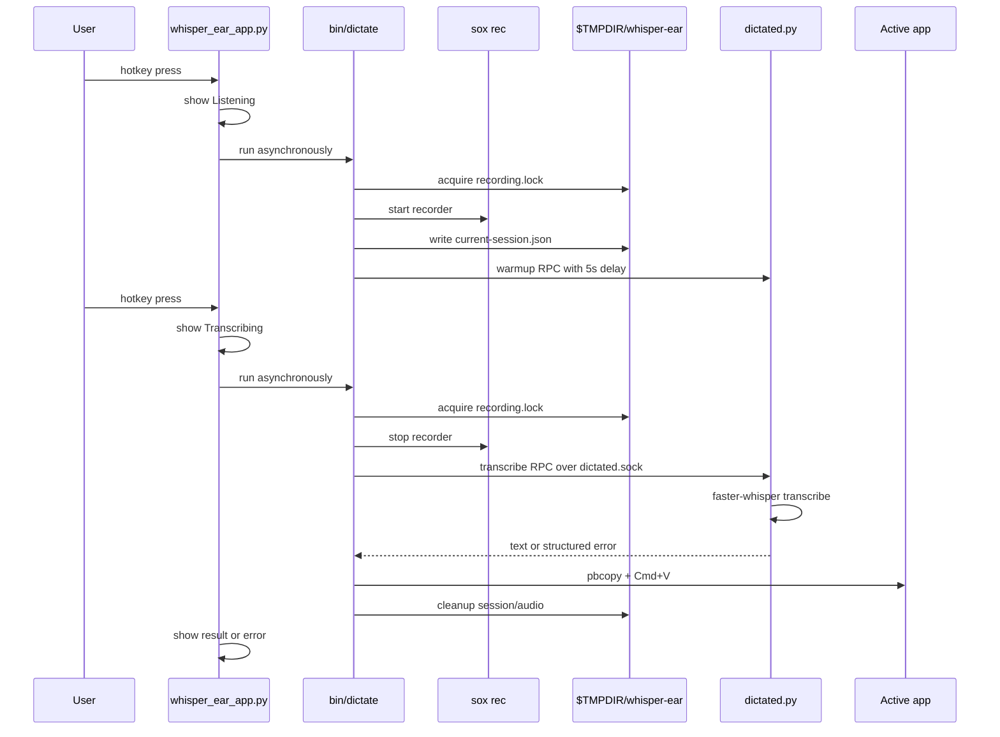
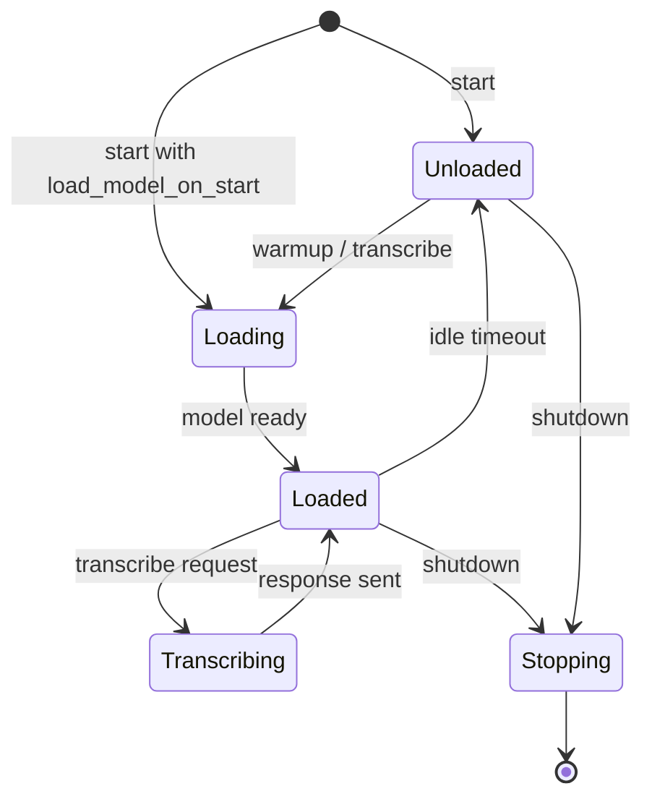
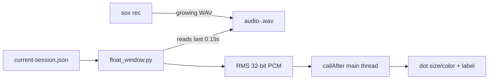

# whisper-ear Architecture

## System Overview



## Dictation Flow



## Daemon Lifecycle



Default startup binds the socket and reports `state=unloaded` without loading
the STT model. `bin/dictate` schedules `warmup(delay_seconds=5)` after recording
starts, so longer recordings hide most model load time while short recordings
avoid immediate CPU load.

### Auto-Unload Rules

| Model | `keep_loaded_models` | Behavior |
|---|---|---|
| `tiny` | yes | Always in RAM, never unloads |
| `base` | yes | Always in RAM, never unloads |
| `small` | no | Unloads after idle timeout |
| `medium` | no | Unloads after idle timeout |
| `large-v3-turbo` | no | Unloads after idle timeout |

## Runtime State

```text
$TMPDIR/whisper-ear/
├── dictated.sock
├── daemon.pid
├── daemon.log
├── recording.lock
├── current-session.json
└── audio-<session-id>.wav
```

| State | Owner |
|---|---|
| Hotkey and overlay state | `whisper_ear_app.py` |
| Recording session and lock | `whisper_ear.recording` |
| Audio file path | `current-session.json` |
| Model lifecycle | `dictated.py` |
| Daemon status | `status` RPC |
| Paste behavior | `whisper_ear.dictate_cli` / `whisper_ear.paste` |

## Daemon IPC

The daemon uses newline-delimited JSON over a per-user Unix domain socket.

Request:

```json
{"method":"transcribe","file":"/tmp/whisper-ear/audio-123.wav","language":null}
```

Success:

```json
{"ok":true,"text":"Hello world"}
```

Error:

```json
{"ok":false,"error":{"code":"no_speech","message":"No speech detected"}}
```

Supported methods:

| Method | Behavior |
|---|---|
| `status` | Return pid, state, model, keep-loaded flag, and last error. |
| `warmup` | Schedule model loading after an optional delay. |
| `transcribe` | Transcribe an existing audio file. |
| `shutdown` | Stop daemon and clean socket/pid files. |

Only one transcription runs at a time. Extra transcription requests receive
`busy`; status requests can still respond.

## Voice Level Visualization



Key detail: audio levels read raw bytes from the file tail, skipping the 44-byte
WAV header. `wave.open()` is avoided because SoX writes a placeholder header
while recording.

## Memory Usage

| Component | RAM | When |
|---|---|---|
| `whisper_ear_app.py` | ~30 MB | While app is running |
| `dictated.py` | ~20 MB plus model | While daemon is running |
| Whisper `base` model | ~145 MB | Default dictation model |
| Whisper `large-v3-turbo` model | ~809 MB | Default file transcription model |
| `sox rec` | ~5 MB | During recording only |
| Runtime WAV | disk only | During recording/transcription |
