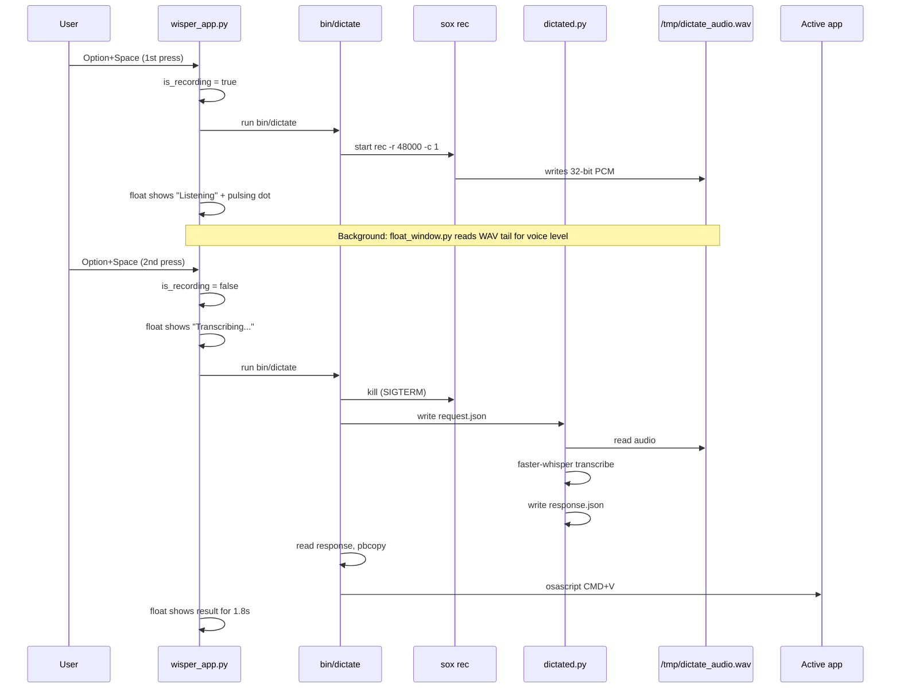
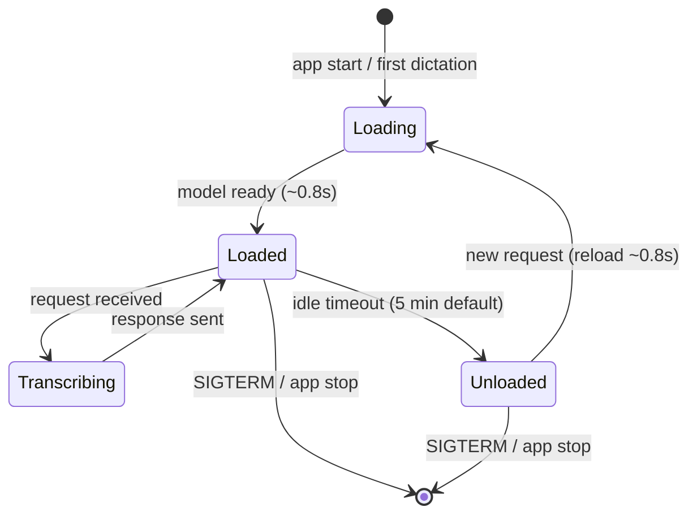
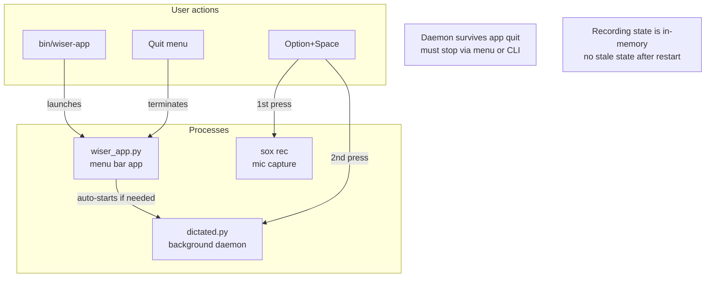

# Wisper Architecture

## System overview

```mermaid
graph TB
    subgraph Menu bar app
        A[wisper_app.py<br/>PyObjC menu bar]
        B[float_window.py<br/>Voice level overlay]
    end

    subgraph Hotkey
        C[Carbon hotkey<br/>Option+Space]
        D[AppKit monitor<br/>fallback]
    end

    subgraph Shell
        E[bin/dictate<br/>toggle script]
        F[sox rec<br/>mic recording]
    end

    subgraph Daemon
        G[dictated.py<br/>background process]
        H[faster-whisper<br/>base model, int8]
    end

    I[/tmp/dictate_audio.wav]
    J[Active app<br/>cursor position]
    K[config.json<br/>hotkey, model, daemon]

    C -->|pressed| A
    D -->|fallback| A
    A -->|1st press| E
    A -->|2nd press| E
    K -.->|reads| A
    A -->|status & dot| B
    E -->|start| F
    F -->|writes| I
    E -->|transcribe request| G
    G -->|uses| H
    G -->|reads| I
    E -->|pbcopy + CMD+V| J
    B -.->|reads tail| I
```

## Dictation flow (step by step)



## Daemon lifecycle (model loading)



### Auto-unload rules

| Model | `keep_loaded_models` | Behavior |
|---|---|---|
| `tiny` | ✅ yes | Always in RAM, never unloads |
| `base` | ✅ yes | Always in RAM, never unloads |
| `small` | ❌ no | Unloads after 5min idle, reloads on demand |
| `medium` | ❌ no | Unloads after 5min idle, reloads on demand |
| `large-v3-turbo` | ❌ no | Unloads after 5min idle, reloads on demand |

Configured in `config.json`:
```json
{
  "daemon": {
    "unload_timeout_minutes": 5,
    "keep_loaded_models": ["tiny", "base"]
  }
}
```

## State management (what lives where)

```mermaid
graph TB
    subgraph In memory — wisper_app.py
        A[is_recording: bool]
        B[float window<br/>position, dot, label]
        C[config dict<br/>hotkey, model, daemon]
    end

    subgraph /tmp — filesystem protocol
        D[dictate_audio.wav<br/>48kHz 32-bit mono]
        E[dictate_recording<br/>PID lockfile]
        F[dictated/request.json<br/>file path + language]
        G[dictated/response.json<br/>transcribed text]
        H[dictated/status.json<br/>state + model + pid]
        I[dictated/daemon.pid<br/>daemon PID]
        J[dictated/daemon.log<br/>timestamped events]
    end

    subgraph Daemon process
        K[dictated.py<br/>polling loop]
        L[WhisperModel<br/>base, CPU, int8]
    end

    A -->|manages| E
    K -->|polls| F
    K -->|writes| G
    K -->|writes| H
    K -->|uses| L
    L -.->|reads| D
```

### Communication protocol

The app and daemon communicate via files in `/tmp/dictated/`:

```
bin/dictate                           dictated.py
    │                                     │
    │  write /tmp/dictated/request.json   │
    │ ──────────────────────────────────> │
    │  {"file": "/tmp/dictate_audio.wav"} │
    │                                     │ load model if unloaded
    │                                     │ transcribe audio
    │  read /tmp/dictated/response.json   │
    │ <────────────────────────────────── │
    │  {"text": "Hello world"}            │
    │                                     │
    │  pbcopy + CMD+V into active app     │
```

## Voice level visualization

```mermaid
graph LR
    A[sox rec<br/>writes WAV] -->|growing file| B[/tmp/dictate_audio.wav]
    B -->|background thread<br/>reads last 0.15s| C[RMS calculation<br/>32-bit PCM samples]
    C -->|level 0..1| D[callAfter<br/>main thread]
    D --> E[dot size: 6–28px]
    D --> F[color: red → green]
    D --> G[label: Waiting / Listening]
```

Key detail: reads **raw bytes** from file tail (skipping 44-byte WAV header), not via `wave.open()`. Sox writes a placeholder header with ~2GB frame count that breaks `wave`.

## Process lifecycle



## Memory usage

| Component | RAM | When |
|---|---|---|
| `wiser_app.py` | ~30 MB | While app is running |
| `dictated.py` (daemon) | ~20 MB | Always (survives app quit) |
| Whisper `base` model | ~145 MB | While loaded (pinned) |
| Whisper `small` model | ~488 MB | While loaded (auto-unloads) |
| `sox rec` | ~5 MB | During recording only |
| `/tmp/dictate_audio.wav` | disk only | During recording |
