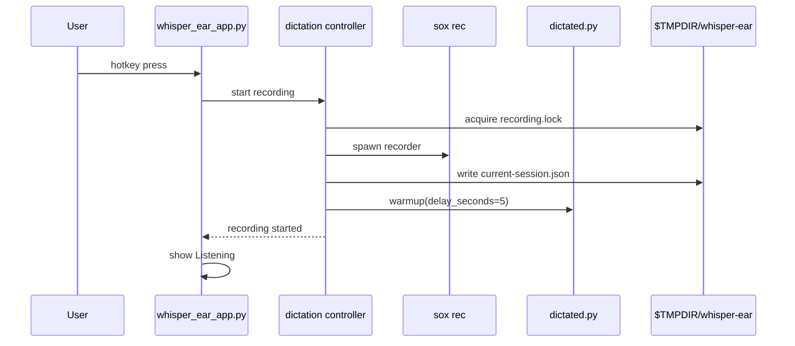
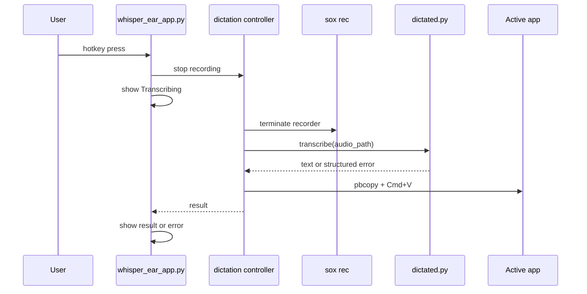

# Dictation Flow

## Purpose

This document defines the correct end-to-end flow for hotkey dictation.

## Component Responsibilities

| Component | Responsibility |
|---|---|
| `whisper_ear_app.py` | Hotkey, menu status, float overlay updates. |
| Dictation controller | Start/stop recorder, call daemon, paste text, cleanup runtime files. |
| `dictated.py` | Warm/load model on request, keep model loaded, transcribe completed audio files. |
| `float_window.py` | Render overlay and read live WAV tail for voice level. |

## Start Recording

## Stop And Transcribe

## UI Thread Rule

The menu app must not block the AppKit event loop while transcription runs.
Long-running controller calls should run in a background thread or subprocess,
then update the UI on the main thread.

## Result Handling

| Result | UI behavior | Paste behavior |
|---|---|---|
| Text returned | Show short result | Paste text |
| `no_speech` | Show no speech | Do not paste |
| `busy` | Show busy | Do not paste |
| Other error | Show error | Do not paste |
